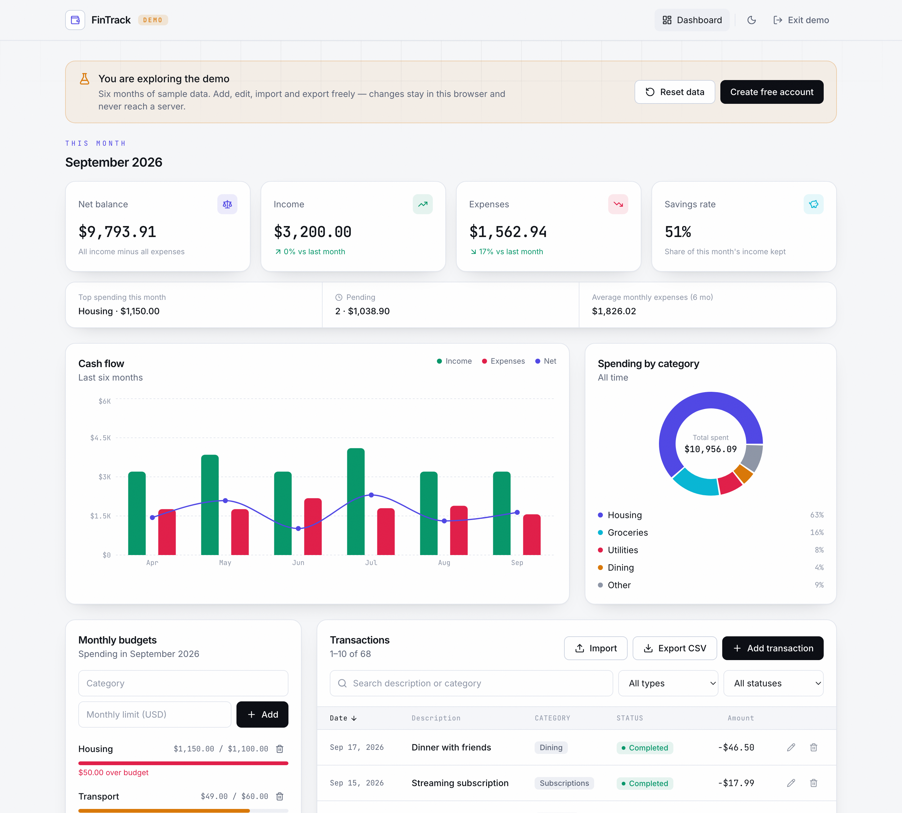

# FinTrack — Finance Dashboard

Track income, expenses and monthly budgets, with charts, Excel/CSV import and CSV export.

**Live:** https://mohamad-dashboard.vercel.app · **Try it without an account:** https://mohamad-dashboard.vercel.app/demo

<p align="center">
  
</p>

## Features

- **Demo mode** — explore the full app with six months of sample data, no sign-up. Demo data stays in the browser and never reaches the database.
- **Overview** — net balance, this month's income and expenses compared with last month, savings rate, pending items and top spending category.
- **Cash flow chart** — income and expenses per month with the net result, plus spending by category.
- **Monthly budgets** — limits per category, measured against the current month, with warnings near and over the limit.
- **Transactions** — search, filter, sort, paginate, add, edit and delete.
- **Import** — `.xlsx` and `.csv`; column names are matched case-insensitively, Excel date cells and German formats (`1.234,56`, `12.09.2026`) are understood, and invalid rows are skipped and reported.
- **Export** — the filtered view as CSV, in the same format the importer reads.
- **Accounts** — sign-up with email confirmation, password reset, profile with avatar and a password change that verifies the current password.
- **Light and dark themes** without a flash on load; respects reduced-motion settings.

## Tech stack

- Next.js 16 (App Router) · React 19 · TypeScript
- Supabase (Auth, Postgres, Storage)
- Tailwind CSS v4 · Recharts · lucide-react
- read-excel-file for spreadsheet import

## Getting started

```bash
npm install
npm run dev
```

Create `.env.local`:

```bash
NEXT_PUBLIC_SUPABASE_URL=your-project-url
NEXT_PUBLIC_SUPABASE_PUBLISHABLE_KEY=your-publishable-key
```

### Database

Tables `transactions` (`id`, `date`, `type`, `description`, `amount`, `category`, `status`, `user_id`) and `budgets` (`id`, `category`, `amount`, `user_id`), and a public storage bucket `avatars`. Row Level Security must be enabled so users only see their own rows:

```sql
alter table public.transactions enable row level security;
alter table public.budgets      enable row level security;

create policy "own transactions" on public.transactions
  for all using (auth.uid() = user_id) with check (auth.uid() = user_id);

create policy "own budgets" on public.budgets
  for all using (auth.uid() = user_id) with check (auth.uid() = user_id);
```

The app additionally filters every update and delete by `user_id`.

## Project structure

```
app/
├── page.tsx                    dashboard
├── demo/                       one-click demo link
├── login · signup · forgot-password · reset-password · profile
├── components/
│   ├── dashboard/              summary, charts, budgets, transactions, dialogs
│   ├── layout/                 navbar, theme toggle, demo banner
│   ├── auth/                   shared auth layout
│   └── ui/                     dialog, confirm dialog
└── lib/
    ├── data.ts                 single data layer (Supabase or demo store)
    ├── demo.ts                 demo mode and sample data
    ├── finance.ts              all dashboard calculations
    ├── import.ts               spreadsheet parsing and CSV export
    └── format.ts               money and date formatting (no UTC shifts)
```

## Author

Built by [Mohamad Hadi Dabbah Aljimal](https://portfolio-mohamad-dabbah.vercel.app).
