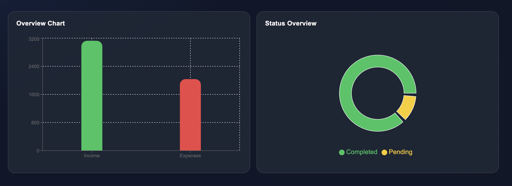
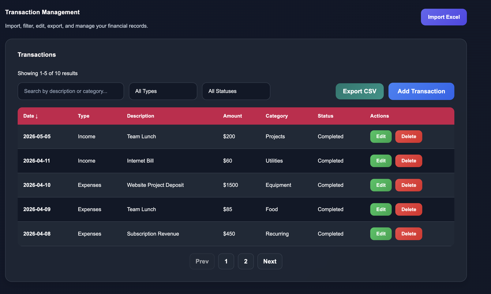
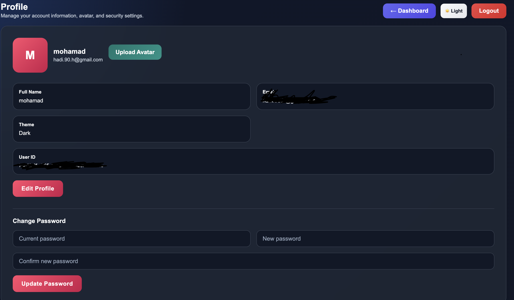

# 💸 FinTrack Dashboard

A modern full-stack finance dashboard built with Next.js and Supabase to track income, expenses, and budgets with a clean and interactive UI.

---

## 🚀 Live Demo

👉 https://mohamad-dashboard.vercel.app

---

## 📸 Screenshots

### Dashboard
Dashboard

### Charts
Charts

### Transactions
Transactions

### Profile
Profile
 

## ✨ Features

- 🔐 Authentication (Login / Signup / Reset Password)
- 📊 Interactive Charts (Bar, Pie, Line)
- 💰 Income & Expense Tracking
- 📁 CSV Export
- 📥 Excel Import
- 🎯 Budget Management
- 👤 User Profile (Avatar + Password Update)
- 🌗 Dark / Light Mode
- ⚡ Real-time data with Supabase

---

## 🛠️ Tech Stack

- Frontend: Next.js (App Router), TypeScript  
- Backend: Supabase (Auth, Database, Storage)  
- Charts: Recharts  
- UI: Custom CSS  
- Notifications: React Hot Toast  

---

## 📂 Project Structure

/app  
/components  
/lib  
/public  
/screenshots  

---

## ⚙️ Environment Variables

Create a .env.local file:

env NEXT_PUBLIC_SUPABASE_URL=your_url NEXT_PUBLIC_SUPABASE_ANON_KEY=your_key 

---

## 🧪 Run Locally

bash npm install npm run dev 

---

## 📦 Build

bash npm run build npm start 

---

## 👨‍💻 Author

Mohamad

---

## ⭐ About This Project

This project is a portfolio-ready finance dashboard demonstrating:

- Full-stack development with Supabase  
- Authentication flows (login, signup, reset password)  
- Data visualization with charts  
- CRUD operations (transactions & budgets)  
- Clean and modern UI/UX  
- Production deployment on Vercel
